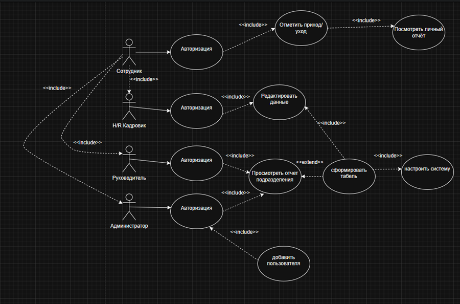
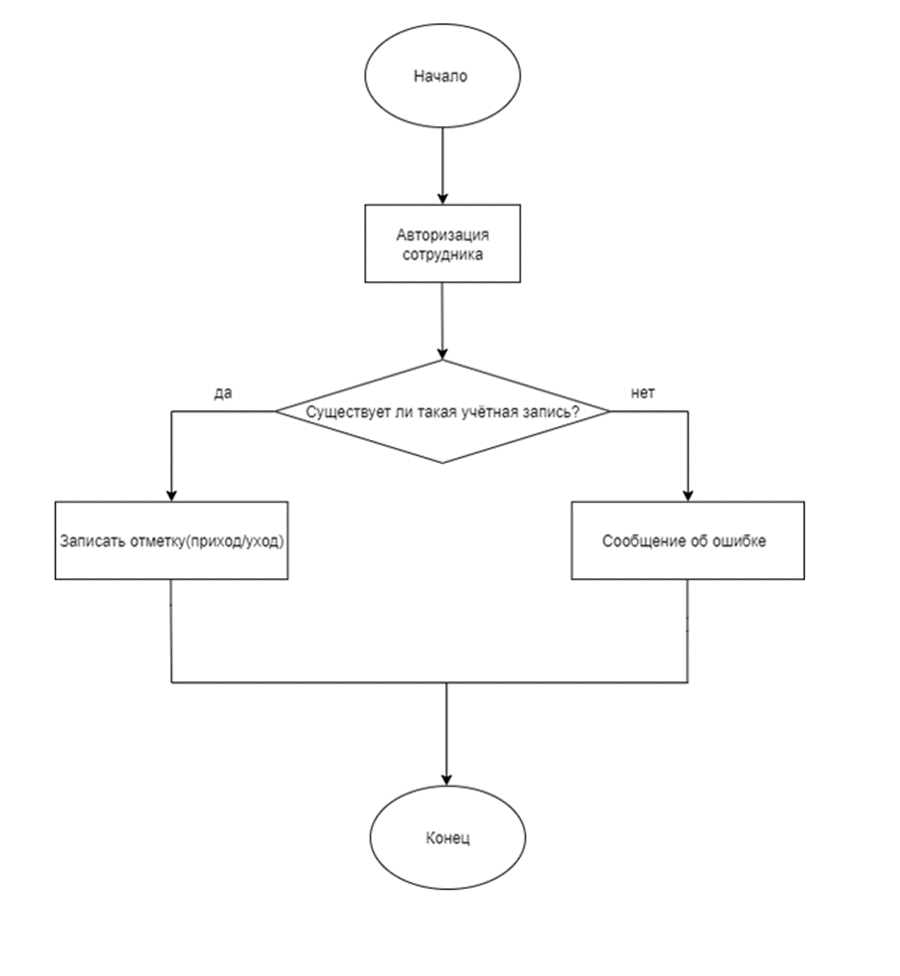
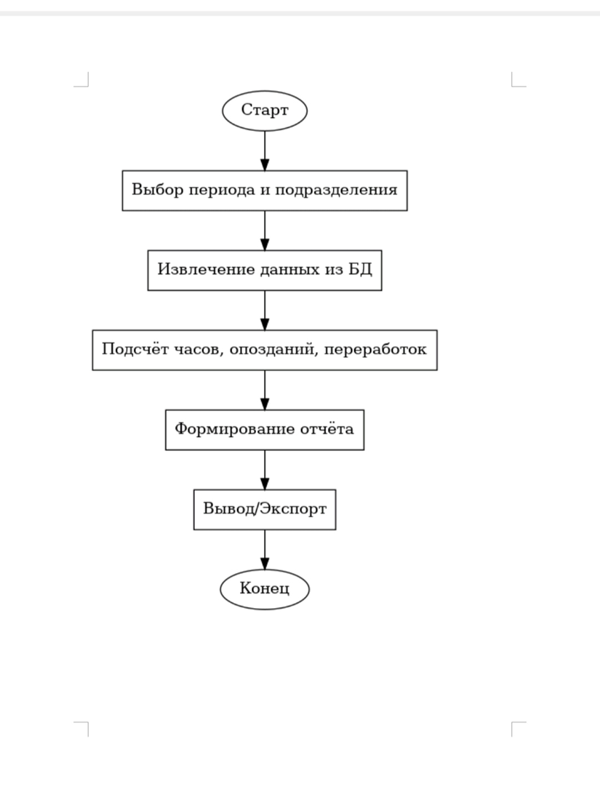

# **Лабораторная работа 2**
Постановка задачи имоделирование процессов информационной системы

Tема: Учет рабочего времени сотрудников

# 1. **Постановка задачи**
### *Предметная область*
В компании необходимо вести учет фактического рабочего времени сотрудников:приходы и уходы, перерывы, переработки, больничные и отпуска. Сейчас учетведется вручную (табели, Excel), что приводит к ошибкам и затрудняет контрольдисциплины.

### *Цели системы*
Автоматизировать регистрацию рабочего времени сотрудников. Упростить контроль дисциплины и наличие опозданий.Формировать отчёты для бухгалтерии и руководителей.Повысить прозрачность и объективность оценки труда.

### *Пользователи (акторы)*:
1. Сотрудник: отмечает приход/уход, подаёт запрос на отпуск или больничный.
2. HR/кадровик:просматривает табели, корректирует ошибки.
3. Руководитель: получает отчёты о посещаемости и переработках.
4. Администратор системы: управляет пользователями и настройками.

### *Функции системы*: 
1. Регистрация начала и конца рабочего дня (через веб-интерфейс или терминал).

2. Учёт отсутствий (отпуск, больничный, командировка).

3. Подсчёт отработанных часов, переработок и опозданий.

4. Формирование индивидуальных и сводных отчётов.

5. Экспорт данных в Excel/CSV.

6. Разграничение прав доступа (сотрудник видит только себя, HR и руководство — всех).

### *Архитектура*
Классическая трёхуровневая архитектура: 
1. Presentation Layer(веб-интерфейс, мобильное приложение).

2. Business Logic Layer(подсчёт времени, контроль правил).

3. Data Layer(БД с таблицами: сотрудники, отметки времени, отчёты)

# 2.* Моделирование процессов*
Use Case диаграмма:

Блок-схема 1 — Регистрация прихода/ухода:

Блок-схема 2 — Формирование отчёта:	

# *Описание программы*:
Программа выводит на экран пользователя сообщение "hello world"